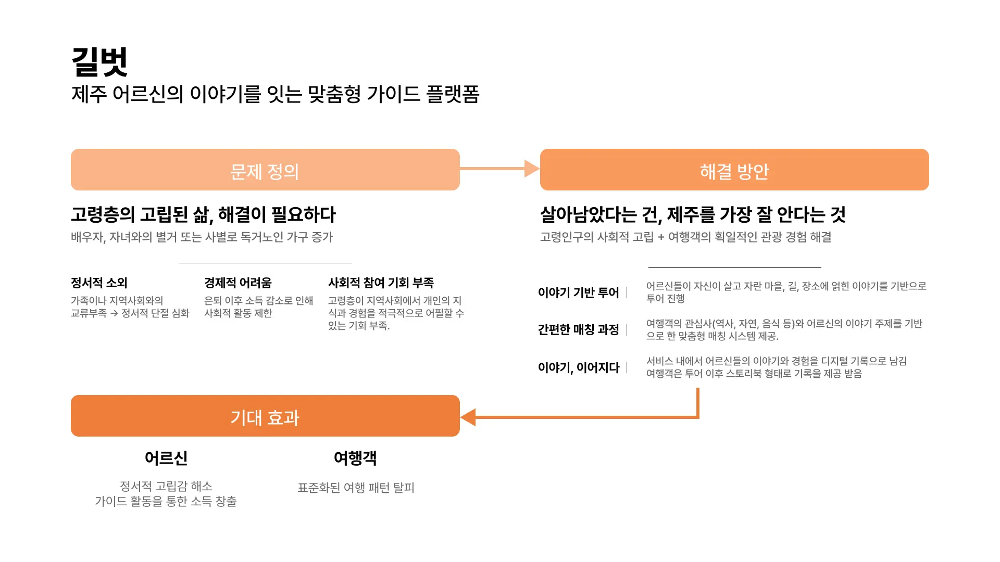
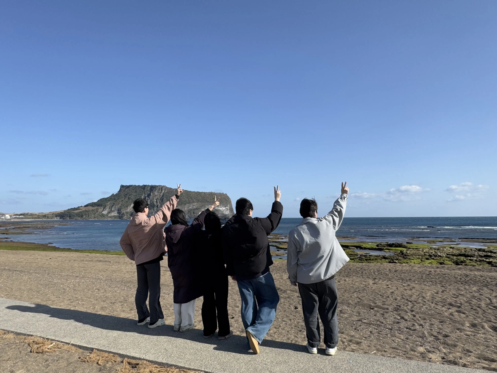
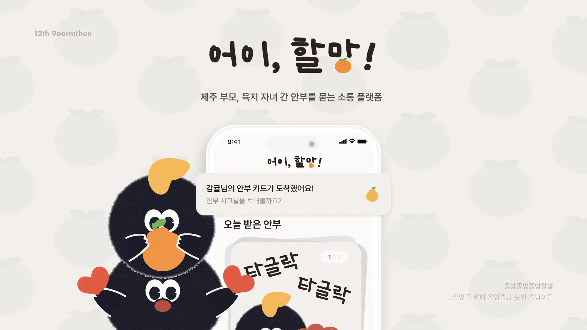

## Intro

I participated in the 12th edition of 9oormthon from December 10, 2024 to December 13, 2024 as a front-end developer.
In this post, I'm going to write about my first hackathon experience.

This article is not only a personal recollection of my first hackathon, but also a helpful guide for prospective Goormoners. This article is organized as follows

1. the application process
2. Day Activities
    1. Day 0
    2. Day 1
    3. Day 2
    4. Day 3
    5. Day 4
3. Outro
---

## Application Process

### Motivation to participate

*"Collaborating with other professions"*.

In the process of IT service development, I wanted to have the experience of understanding the results of planners and designers and developing ideas together by requesting modifications or adding opinions.
On the other hand, I wanted to experience explaining the problems that may arise during the programming process so that the planners and designers could understand.
At 42seoul, I mainly collaborated with people who are in development or have learned development, so I wanted to collaborate with people who have a low understanding of development at this Goormathon.

*"Fast and accurate product development training"*

In general, accuracy and speed are inversely proportional. However, in the real world, you have to set deadlines and develop products accordingly.
I joined Goormtone to train on speed and accuracy in an intensive immersion program.

### Fill out the application

There were 5 common questions in the application + 1 question specific to the development role.

1. motivation to participate in Goormathon
2. social issues facing Jeju Island recently
3. service ideas to solve the above problems
4. Your strengths to lead a flexible collaboration.
5. Goal for 'growth' in Goormathon
6. Description of projects you have worked on.

I focused more on 2, 3, and 6 of the above items in my application.

Especially for items 2 and 3, I spent more time on presenting a service idea to solve the problem, although it is important to accurately diagnose the current social problems on Jeju Island.
When I was writing the application, I thought that the definition of the problem was similar to everyone else's and that there was nothing new to come up with, so I thought it was more important to present ideas on how to solve the problem accurately.

Also, item 6 was to describe previous projects, and I was going to introduce the projects that 42seoul has done ([webserv](https://github.com/WebWaveMaker/webserv), [ft_transcendence](https://github.com/42ForYou/ft_transcendence), etc,
I didn't think I could explain the motivation and goal of the project well, so I introduced the [obsidian-go-up](https://github.com/JinMuGo/obsidian-go-up) project, which was a simple plugin for the note-taking app Obsidian.

As much as possible, I tried to incorporate the problem definition of why I did this project and how I tried to solve it into the text.

{/* TODO: link to the obsidian-go-up post*/}

Luckily, I passed and was able to participate in the goormathon.

## Daily activities

### Day 0

I arrived in Jeju Island on 12.09, the day before, and prepared to participate in the Goormathon.

{/* TODO: 18 second introductory post and link */}

#### Write your bio

Since I will be giving a 3-minute pitch on Day 1 of Goormathon, I decided to create a bio page on Notion.
I was not good at introducing myself, so I read the book 18 Seconds to Introduce Yourself [^self-pr-book], which I found in the library by searching for the keyword "introduction", and wrote a page based on it.
I will write a review of the book later.

When I wrote the page and prepared the script, I used the
<Callout type="info">.
  The bio is not about introducing yourself, it's about introducing the future the listener can get by getting involved.
</Callout>.

I wrote it in a way that introduced my experience and what the listener could get out of it.
I positioned myself as a pacemaker for the CloudTalkers and tried to convey the message that it would be great if others would "team up and collaborate!" with me.

### Day 1

Day 1 consisted of a lecture about the hackathon, introductions, and a presentation of the foundation topic.

#### Hackathon Lecture - Hackathon Excitement with Open Source

Before the Goormathon, there was a lecture that gave us a general overview of what kind of mindset we should have for the hackathon.

He emphasized the importance of choice and focus, especially due to the nature of hackathons where you have to develop a product in a short time.
He also introduced how to stand on the shoulders of giants, i.e., how to develop quickly by utilizing already developed open source or how to quickly materialize ideas by utilizing design tools such as Lean Canvas.

In the MVP development process, we emphasized the following points.

- Prioritize speed over perfection: Focus on implementing ideas quickly rather than developing a perfect product.
- Focus on one thing rather than broader concerns: Focus on the right features (functionality) and measure the success of those features.
- Agility instead of waterfall: Don't focus on process and procedure, prioritize speed with division of labor and collaboration.
- Practicality, not more features: Don't boast as many features as possible, but provide specific value to users.

Rather than trying to be all-encompassing and all-encompassing in a short period of time, we felt it was important to focus on one thing we wanted to deliver and deliver it well.
We felt it was important to dig into the core and find the wow factor.

And you gave us some tips on what not to do at this hackathon, and one of them was "just work hard".
He emphasized that we shouldn't just focus on building and implementing something, and that we shouldn't forget the context of why and how our team is doing what we're doing.
This is similar to what I ultimately wanted to accomplish in this hackathon, so I took it to heart and went into Goormathon.

#### Self PR

After the lecture and lunch, we had a 3-minute self-pitch.

I have a phobia of public speaking, so I memorized the script I prepared in advance. However, the staff helped me break the ice and I was able to relax while listening to other people's presentations.
Since the hackathon was held in Jeju Island, everyone came from different places. If it was held in Seoul, I don't think I would have been able to meet such a diverse group of people.
I was so nervous that I couldn't concentrate on other people's presentations, but if I had this opportunity again, I would work harder to prepare my presentation and listen to other people's presentations more intently.

#### Hackathon Lecture - How to Grow from a Hackathon

There was another hackathon talk, this one about how to grow from a hackathon.

He talked about DONE and PERFECT. Most of us think
**tend to perceive DONE as not perfect and PERFECT as not done.
In a hackathon, everyone has a different definition of DONE. And he said that DONE and PERFECT are not polar opposites.

There is GROWTH in between DONE and PERFECT. If you are currently between DONE and PERFECT, getting closer to PERFECT is growth.

"PERFECTLY DONE." It was a talk that resonated with me.

---

And at the end of the first day, there was an idea topic presentation. The theme of this 12th edition was "Aging.

When I wrote my application, I was fortunate enough to present a service related to aging, so I elaborated on it a bit and made a PPT.

In the middle of the first day, I went out for a walk with my teammates, and in the evening, I had a fun time eating black pork with other goormoners.

<Parallel> </Parallel>

### Day 2

#### 2 min IDEATION

We presented the IDEATION in a PPT for 2 minutes, and then proceeded with team building.

I proposed a service called 'Gilbot'. I presented a one-minute solution to a one-minute problem with a simple framework.

Since the presentation time was short and I only had one PPT, I was able to present with less nervousness than yesterday.
Afterward, I listened to other people's presentations and thought about who I would like to team up with and what ideas I would like to share.

#### teambuilding

The team building time was like a market. There was no system, everyone just asked for their favorite teammates and formed a team.
I had a list of people I wanted to work with beforehand, and luckily I didn't have much trouble organizing my team. If you're going to participate in Goormathon, I would recommend that you think about who you want to team up with and what ideas you want to bring to the table during the team building time.
There is a certain amount of "luck" involved. We were often teamed up with people who were relatively close to us based on our initially randomized seats.

So if you have a goal or outcome you want, it's important to be proactive about it. I think you'll be more satisfied with the outcome if you take the initiative to build a team rather than hoping for teammates to come to you.

That's how our team "[**Olmangolmangolmangolmang**](https://github.com/ddol-mang)" was formed. It was a team name that the organizer came up with out of the blue, but I really liked it.
A bunch of old ladies gathered for old ladies. It's a good name.

#### Select a topic

After the team was formed, we had a brainstorming session to select topics that fit the theme of "Jeju Island", "Cloud", and "Aging".
However, it was not easy to choose a service that fits the theme.
We could not fundamentally solve the social problem of aging, so we decided to develop a service that can alleviate or solve the problems caused by aging.

#### Beer Party

We had a beer party where we could communicate with other team members besides the formed team.

They were based on three different timetables

1. time to chat with people sitting in randomly assigned seats (6-7:30)
2. free-flowing conversations at job-specific tables - with mentor participation (7:30-9:00)
3. free time to chat with other team members (9-11)

This was by far my favorite part of the hackathon. It was fun to talk to other people, and I was able to think about various things while listening to their stories.
As the representative of Goormathon said, I think the best way to enjoy the hackathon is to network with others as much as possible at the beer party.
I left the beer party a little early because I was anxious that the topic hadn't been selected yet, but I thought that if I had this opportunity next time, I would enjoy it fully and communicate with others.

#### Decide on a topic

After the beer party, I spent some time with my teammates to decide on a topic. We had to choose a topic before we started the hackathon.
I think we talked about a lot of things. A service for seafarers. The connection between the elderly and the young. We discussed many topics, such as services using grandparents' homes, such as temple stays.
However, we were rejected for various reasons.

We chose our topic based on a newspaper article that was published on the day of the hackathon.

<Callout reference="When the elderly in Jeju feel happy" link="https://www.jejunews.com/news/articleView.html?idxno=2215293">
  In other words, the happiness of the elderly is that their children are healthy, their children are married and living in harmony...(interruption)

  In "life satisfaction", "**relationship with children**" has a greater impact than living standards or current life.
  In short, older adults on Jeju Island have their children at the center of their happiness, but they are relationship-oriented, not dependent, and they explore independence and meaning in life through work, and they value their children's health and happiness more than their own.
</Callout>

This sentence made us realize that there is a need for connectivity between offshore parents and mainland children, and to solve this problem, we decided to develop a platform for parents and children to communicate their current status with a few simple touches.

As more and more people are living away from their families, it is becoming difficult to communicate with their parents.
We chose the topic because everyone on the team was interested in and sympathetic to this issue. Personally, I was thrilled when the topic was first decided.
We stayed up until 4 a.m. to discuss and refine our ideas, but it was so much fun that we lost track of time.
I was worried before the hackathon because I'm a light sleeper and a night owl, but my fears were unfounded.

I decided to go back to my room and sleep for tomorrow. We shared our rooms with our teammates on KakaoTalk and went to bed, as we were all worried that something would go wrong.

### Day 3

After the topic was selected, we had a meeting to develop a specific service, specifying the API and DB, and making a front-end development plan according to the designer's screen design.
I was not familiar with libraries such as react-query and zustand yet, so I asked another front-end developer to focus on screen implementation + back-end API.
I was in charge of implementing the screen + setting up the deployment environment for the front-end unit.

When implementing the screen and frontend logic, the other frontend developer helped me a lot in the areas where I was lacking, so I was able to develop quickly.

During this development, I noticed that our service kept flickering every few seconds.
I realized the problem at 4am and worked on it for about 2 hours, and then realized that our service was running in development mode.
I thought this was the problem and wanted to change it to production mode, but I didn't understand Crampoline, so I asked my mentors for help.
My objective was simple. Our service was developed with vite, and I wanted to change it from running in development mode to running in production mode.
Eventually, with the help of the mentors, I was able to solve the problem and no more flickering occurred. The story goes like this

We had to find a way around the difficulty of deploying with crampolines, which is what we originally wanted to do, which was to spin up a static server with nginx.
So the backend guy asked his mentor for help, and in the process, we ended up spinning up the frontend server in development mode.
This wouldn't have happened if we had added a script in the package.json that would run in a more intuitive production mode, such as `start` instead of `preview`.
This was a good reminder of the importance of abstraction. Somehow, once I solved the problem, I was able to focus on other development.

Meanwhile, the planners and designers were preparing for the presentation. I apologized to the planners and designers for not being able to participate much in the preparation process.
The next day, the presentation and development were finished by almost 10 o'clock, so I went to the hostel to pack my things before 11 o'clock.

--- --- --- ------.

A photo of Seongsan Sunrise Peak on Day 3 with the team members.

<Parallel> </Parallel>

### Day 4

#### Hackathon announcement

We presented our service "[Hey, Grandma]" (https://github.com/ddol-mang/hey-oldlady), which we prepared all night.

Our presentation strategy was to appeal to the emotions of parents and children living apart from their parents.
We presented the problem through news and statistics and introduced a service to solve it.

However, the feedback from the presentation raised the question of whether the features and problem awareness we presented were **actually needed by users**.
We thought a lot about it, but we regretted that we didn't make our logic sufficiently clear enough to explain it.

However, I believe that our service is about user experience, focusing on the keyword **aging**. And I think it was meaningful to focus on a simple user flow to address this.
I'm proud of our team for coming up with this much in such a short time.

## Outro

True to the values of Goormtone, I was able to experience and learn a lot in a very short period of time.

As it was my first hackathon, there were a lot of inexperience, but fortunately, I was able to meet good teammates, build memories, and have fun together.
We were so immersed in the development that we forgot to sleep at night, and we learned a lot in the process. I couldn't have done it without my team.
The first hackathon buttoned up so well that I can't wait to participate in the next one.

There are many reasons to participate in a hackathon, but I think it's all about the experience.
The process of intensely thinking and developing ideas with teammates is purely enjoyable. This fact alone makes it worthwhile.
So if you're thinking about participating in a hackathon, don't hesitate to do so.

The networking with other cool people is a bonus.

[^self-pr-book]: [18 Second Self-Pitch](https://www.aladin.co.kr/shop/wproduct.aspx?ItemId=94177413)